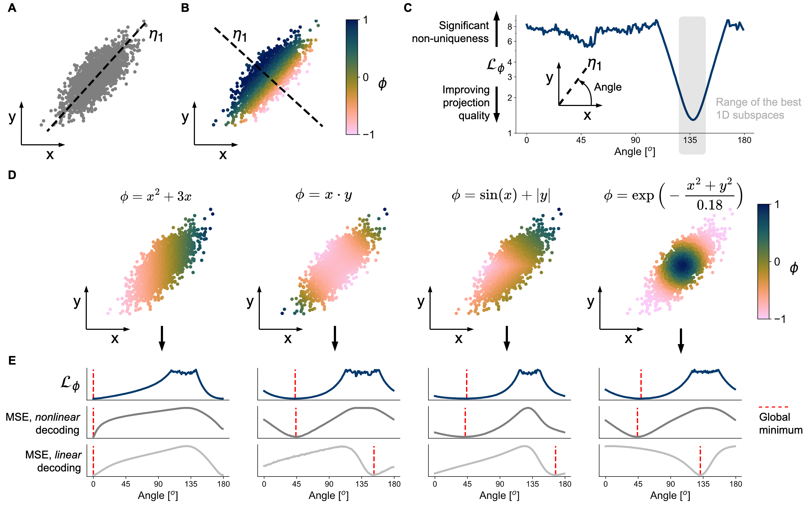
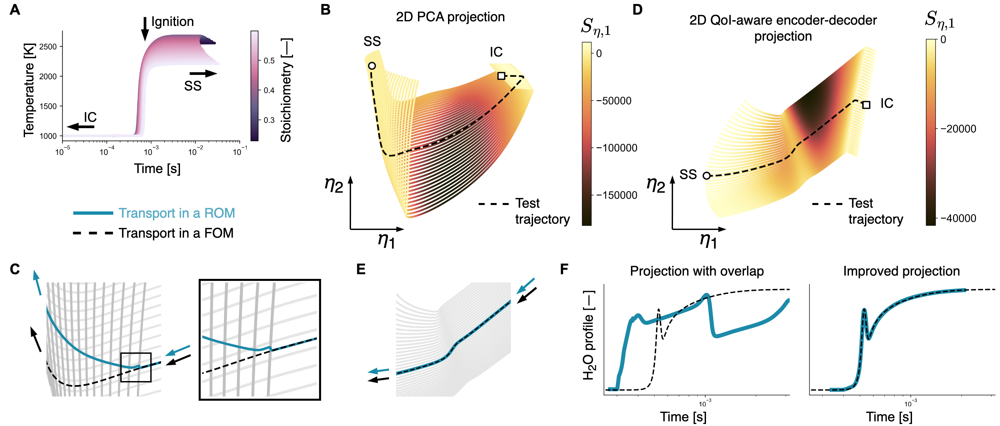

# 📄 *Improving reduced-order models through nonlinear decoding of projection-dependent model outputs*

## Data

Datasets used in this study are stored in the `data/` directory. These include multivariate combustion datasets for:

- hydrogen
- syngas
- methane
- ethylene

## Code

Results can be reproduced using scripts contained in the `scripts/` directory. The chronology of running these scripts is as follows:

1. [`QoIAwareProjection-train.py`](https://github.com/kamilazdybal/nonlinear-decoding/blob/main/scripts/QoIAwareProjection-train.py)
2. [`QoIAwareProjection-VarianceData.py`](https://github.com/kamilazdybal/nonlinear-decoding/blob/main/scripts/QoIAwareProjection-VarianceData.py)
3. [`QoIAwareProjection-kernel-regression-2D.py`](https://github.com/kamilazdybal/nonlinear-decoding/blob/main/scripts/QoIAwareProjection-kernel-regression-2D.py) and [`QoIAwareProjection-kernel-regression-3D.py`](https://github.com/kamilazdybal/nonlinear-decoding/blob/main/scripts/QoIAwareProjection-kernel-regression-3D.py)

Scripts 1. and 2. can take a long time to run. Script 2. is parallelized and it is highly recommended that it is run on multiple CPUs. We have completed our computations running this script on 64CPUs, where looping over 100 random seeds for a single dataset takes about 20 hours to complete.

Our open-source Python library, [**PCAfold**](https://pcafold.readthedocs.io/en/latest/index.html), is required. Specifically, the user will need the class [`QoIAwareProjection`](https://pcafold.readthedocs.io/en/latest/user/utilities.html#class-qoiawareprojection). More information can be found in this [illustrative tutorial](https://pcafold.readthedocs.io/en/latest/tutorials/demo-qoi-aware-encoder-decoder.html).

For results reproducibility, we use fixed random seeds for neural network initialization and training. The exact values for random seeds can be retrieved from the code provided.

## Jupyter notebooks

Once the results are obtained using these scripts, the following Jupyter notebooks can be used to post-process results and generate figures:

### Reproducing Figure 2

This [Jupyter notebook]() can be used to reproduce results from this figure:

### Reproducing Figure 3

These two Jupyter notebooks:

- [Jupyter notebook](jupyter-notebooks/QoIAwareProjection-inspect-projections.ipynb)

- [Jupyter notebook](jupyter-notebooks/QoIAwareProjection-draw-PDFs.ipynb)

can be used to reproduce results from this figure:

### Reproducing Figure 4

This [Jupyter notebook](jupyter-notebooks/QoIAwareProjection-kernel-regression.ipynb) can be used to reproduce results from this figure:

