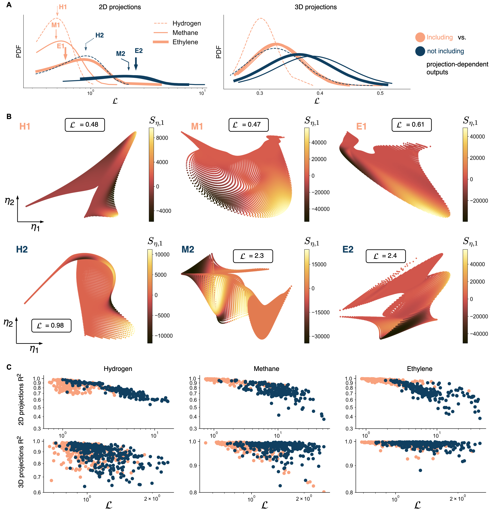

# 📄 *Improving reduced-order models through nonlinear decoding of projection-dependent outputs*

This repository contains code, datasets, and results from the paper:

> K. Zdybał, A. Parente, J. C. Sutherland - *Improving reduced-order models through nonlinear decoding of projection-dependent outputs*, Patterns, 2023

## The bigger picture

Large datasets are increasingly abundant in various scientific and engineering disciplines. Multiple physical variables are frequently gathered into one dataset, leading to high data dimensionality. Visualizing and understanding multivariate datasets, and building data-driven models based on the collected variables can be achieved through dimensionality reduction. However, in many reduction techniques to date, there is no guarantee that the reduced data representation will posses certain desired topological qualities. We show that the quality of reduced data representations can be significantly improved by informing data projections by target quantities of interest (QoIs), some of which are functions of the projection itself. The target QoIs are often known to researchers as variables that should be well represented on a projection. Those can include closure terms required in modeling, important physical variables other than the state variables, or class labels in the case of categorical data. Our approach of computing improved data representations can find application in all areas of science and engineering that aim to reduce the dimensionality of multivariate datasets, as well as in fundamental research of representation learning. This work can have particular relevance in efficient data visualization and in efficient modeling of dynamical systems with many degrees of freedom.

## Graphical abstract

## Data

Datasets used in this study are stored in the [`data/`](data/) directory. These include multivariate combustion datasets for:

- Steady laminar flamelet, hydrogen
- Steady laminar flamelet, syngas
- Steady laminar flamelet, methane
- Steady laminar flamelet, ethylene
- Zero-dimensional reactor, syngas

## Code

The main results can be reproduced using scripts contained in the [`scripts/`](scripts/) directory. The chronology of running these scripts is as follows:

1. [`QoIAwareProjection-train.py`](scripts/QoIAwareProjection-train.py)
2. [`QoIAwareProjection-VarianceData.py`](scripts/QoIAwareProjection-VarianceData.py)
3. [`QoIAwareProjection-kernel-regression-2D.py`](scripts/QoIAwareProjection-kernel-regression-2D.py) and [`QoIAwareProjection-kernel-regression-3D.py`](scripts/QoIAwareProjection-kernel-regression-3D.py)

Scripts 1. and 2. can take a long time to run. Script 2. is parallelized and it is highly recommended that it is run on multiple CPUs. We have completed our computations running this script on 64CPUs, where looping over 100 random seeds for a single dataset takes about 20 hours to complete.

The results for the synthetic dataset from Fig. 2. can be run on multiple CPUs using the following scripts:

1. [`illustrative-example-linear-reconstruction-from-a-subspace.py`](scripts/illustrative-example-linear-reconstruction-from-a-subspace.py)
2. [`illustrative-example-nonlinear-reconstruction-from-a-subspace.py`](scripts/illustrative-example-nonlinear-reconstruction-from-a-subspace.py)
3. [`illustrative-example-costs.py`](scripts/illustrative-example-costs.py)

Our open-source Python library, [**PCAfold**](https://pcafold.readthedocs.io/en/latest/index.html), is required. Specifically, the user will need the class [`QoIAwareProjection`](https://pcafold.readthedocs.io/en/latest/user/utilities.html#class-qoiawareprojection). More information can be found in this [illustrative tutorial](https://pcafold.readthedocs.io/en/latest/tutorials/demo-qoi-aware-encoder-decoder.html). We recommend a Python stack with `Python>=3.8` and the latest versions of all the necessary modules.

For results reproducibility, we use fixed random seeds for neural network initialization and training. The exact values for random seeds can be retrieved from the code provided.

## Jupyter notebooks

Once the main results are obtained using the scripts from the [`scripts/`](scripts/) directory, the following Jupyter notebooks can be used to post-process results and generate figures:

### Reproducing Figure 1

- This [Jupyter notebook](jupyter-notebooks/QoIAwareProjection-evolving-projection-illustration.ipynb) can be used to reproduce results from **Fig. 1B** and from the **Graphical abstract**.

***

### Reproducing Figure 2

- This [Jupyter notebook](jupyter-notebooks/QoIAwareProjection-nonlinear-decoding-on-synthetic-data.ipynb) can be used to reproduce results from **Fig. 2**.

***

### Reproducing Figure 3

- This [Jupyter notebook](jupyter-notebooks/QoIAwareProjection-draw-PDFs.ipynb) can be used to reproduce results from **Fig. 3A**.
- This [Jupyter notebook](jupyter-notebooks/QoIAwareProjection-selected-2D-projections.ipynb) can be used to reproduce results from **Fig. 3B**.
- This [Jupyter notebook](jupyter-notebooks/QoIAwareProjection-kernel-regression.ipynb) can be used to reproduce results from **Fig. 3C**.

***

### Reproducing Figure 4

- This [Jupyter notebook](jupyter-notebooks/QoIAwareProjection-zero-dimensional-reactor-FOM.ipynb) can be used to reproduce results from **Fig. 4A**.
- This [Jupyter notebook](jupyter-notebooks/PCA-zero-dimensional-reactor-ROM.ipynb) can be used to reproduce results from **Fig. 4B-C** and **Fig. 4F**.
- This [Jupyter notebook](jupyter-notebooks/QoIAwareProjection-zero-dimensional-reactor-ROM.ipynb) can be used to reproduce results from **Fig. 4D-F**.

***

### Reproducing Supplementary Figures S1-S2

- This [Jupyter notebook](jupyter-notebooks/QoIAwareProjection-MSE-loss-convergence.ipynb) can be used to reproduce results from **Figs. S1-S2**.

***
